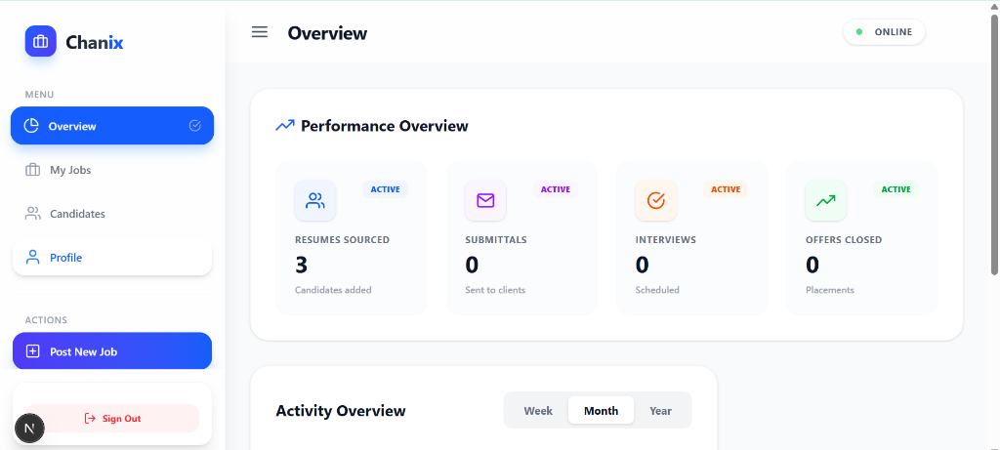
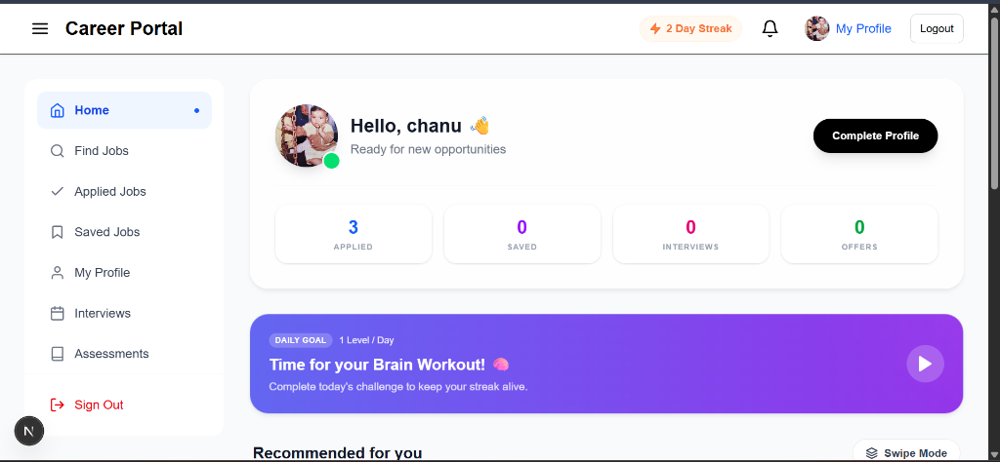

# Chanix - The Future of AI Recruitment

Chanix is a hyper-premium AI recruitment platform designed to revolutionize the hiring process. By leveraging advanced AI for structured interviews and precision candidate matching, Chanix eliminates bias and drastically reduces hiring cycles from months to weeks.

## 🚀 Visual Showcase

### Landing Page


### Recruiter Dashboard


### Career Portal (Jobseeker)


---

## ✨ Key Features

- **AI-Driven Interviews**: Automated, structured interviews that ensure fair and consistent evaluation.
- **Precision Matching**: Advanced algorithms that connect talent with the right opportunities based on skills, not just resumes.
- **Recruiter Analytics**: Comprehensive dashboards for tracking performance, submittals, and placement metrics.
- **Career Portal**: A dedicated space for candidates to find jobs, track applications, and improve their "Brain Workout" streak.
- **Responsive Design**: A premium, supercar-themed UI optimized for all devices.

---

## 🏗️ Project Architecture

The project is structured as a monorepo with three primary modules:

- **Frontend**: Built with **Next.js**, **React**, and **Tailwind CSS**, focusing on high-performance animations and a premium UX.
- **Backend**: A robust **Node.js/Express** API connected to **MongoDB** for secure data management.
- **AI Engine**: A specialized **Python** service that handles interview logic and candidate assessment.

---

## 🛠️ Getting Started

### Prerequisites
- Node.js (v18+)
- MongoDB (Running locally or via URI)
- Python (v3.9+)

### Installation

1. **Clone the repository**:
   ```bash
   git clone https://github.com/Chanikya-Sanapala/SMART_ENGINE.git
   cd SMART_ENGINE
   ```

2. **Setup Backend**:
   ```bash
   cd backend
   npm install
   # Configure .env with MONGODB_URI and PORT
   npm run dev
   ```

3. **Setup Frontend**:
   ```bash
   cd ../frontend
   npm install
   npm run dev
   ```

4. **Setup AI Engine**:
   ```bash
   cd ../ai
   pip install -r requirements.txt
   python app.py
   ```

---

## 🧰 Tech Stack

- **Frontend**: Next.js 15, Tailwind CSS, Vanta.js (Three.js), Recharts
- **Backend**: Node.js, Express, MongoDB
- **AI**: Python, NLP Libraries
- **Styling**: Modern, high-contrast aesthetic with Glassmorphism and Cinematic animations.

---

© 2024 Chanix. All rights reserved.
